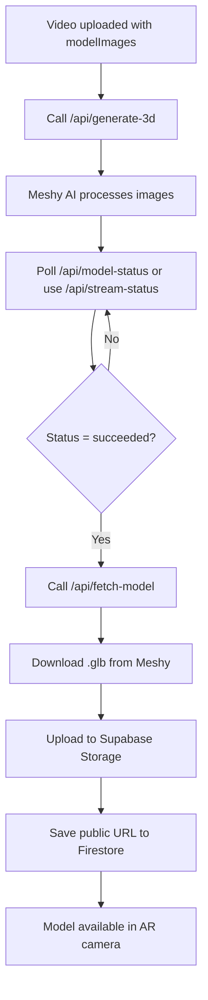

# Meshy AI Backend Integration Summary

## ✅ **BACKEND STATUS: FUNCTIONAL**

Your Meshy AI backend is **fully implemented and functional**. Here's what it provides:

## 🔧 **Available API Endpoints**

### 1. Health Check
- **GET** `/api/health`
- Tests if backend is running

### 2. Generate 3D Model
- **POST** `/api/generate-3d`
- **Input**: `{ "video_id": "...", "user_id": "..." }`
- **Function**: Fetches `modelImages` from Firestore → Sends to Meshy AI
- **Output**: Task ID for tracking progress

### 3. Check Model Status
- **GET** `/api/model-status/<task_id>`
- **Function**: Polls Meshy AI for generation progress
- **Output**: Status, progress percentage, model info

### 4. Stream Status Updates (Real-time)
- **GET** `/api/stream-status/<task_id>`
- **Function**: Server-sent events for live progress updates
- **Output**: Real-time status stream

### 5. Fetch Completed Model
- **POST** `/api/fetch-model`
- **Input**: `{ "task_id": "...", "user_id": "..." }`
- **Function**: Downloads .glb file → Uploads to Supabase → Saves URL to Firestore
- **Output**: Public model URL, Firestore document ID

### 6. List Models for Video
- **GET** `/api/models/video/<video_id>`
- **Function**: Gets all 3D models specific to a video
- **Output**: Array of models linked to that video

### 7. List All Models
- **GET** `/api/models/list?user_id=...`
- **Function**: Lists available models (optionally filtered by user)
- **Output**: Array of all available models

### 8. Delete Model
- **DELETE** `/api/delete-model/<model_id>`
- **Function**: Removes model from both Supabase and Firestore

---

## 🔄 **Complete Workflow**



---

## 📱 **Flutter Integration**

### Service Layer
- **`MeshyApiService`** Created
- Handles all backend communication
- Provides typed methods for each API endpoint
- Includes error handling and streaming support

### AR Camera Integration
- **`MeshyARCamera`** Updated  
- Uses `MeshyApiService` instead of raw HTTP calls
- Loads models specific to the current video
- Supports real-time generation progress
- Places 3D models in AR scene

### Video Player Integration
- **`UploadedVideoPlayer`** Already connected
- "View in AR" button opens `MeshyARCamera`
- Passes `videoId` to load specific models

---

## **How to Use**

### 1. Start the Backend
```bash
cd c:\ReXplore\Thesis\backend
python app.py
```
**Server runs on:** `http://localhost:5000`

### 2. Update Service URL
In `MeshyApiService`, change:
```dart
static const String baseUrl = 'http://localhost:5000';
```
To your deployed backend URL when ready.

### 3. Test the Integration
```bash
python test_meshy_integration.py
```

### 4. Video-Specific Models
1. Upload a video with `modelImages` in Firestore
2. Open the video → Tap "View in AR"  
3. Tap menu → "Generate from current video"
4. Wait for processing → Model appears in AR

---

## **Database Structure**

### Firestore Collections

#### `videos`
```json
{
  "id": "video123",
  "modelImages": ["url1", "url2", "url3"],
  "meshyTaskId": "task_abc123",
  "meshyStatus": "processing",
  "userId": "user456"
}
```

#### `generated_models_files`
```json
{
  "id": "model123", 
  "userId": "user456",
  "videoId": "video123",
  "taskId": "task_abc123",
  "modelFileUrl": "https://supabase.co/models/task_abc123.glb",
  "status": "ready",
  "createdAt": "2025-01-15T10:30:00Z"
}
```

### Supabase Storage
- **Bucket**: `models`
- **Files**: `{taskId}.glb`
- **Public URLs**: Stored in Firestore

---

## 🔑 **Configuration Required**

1. **Firestore**: Already configured 
2. **Supabase**: Already configured   
3. **Meshy AI Key**: Already configured 
4. **CORS**: Enabled for Flutter 

---

## ⚡ **Performance Features**

-  **Real-time Progress**: Server-sent events
-  **Video-Specific Models**: Models linked to videos  
-  **Background Processing**: Non-blocking generation
-  **Error Recovery**: Comprehensive error handling
-  **Streaming Updates**: Live status updates
-  **Model Caching**: Supabase storage with public URLs

---

##  **Next Steps**

1. **Deploy Backend**: Use Heroku, Railway, or similar
2. **Update URLs**: Change localhost to deployed URL
3. **Test on Device**: AR requires physical device
4. **Add User Auth**: Replace hardcoded user IDs
5. **Handle Permissions**: Camera and AR permissions

**Your backend is ready to generate and display 3D models in AR!** 
